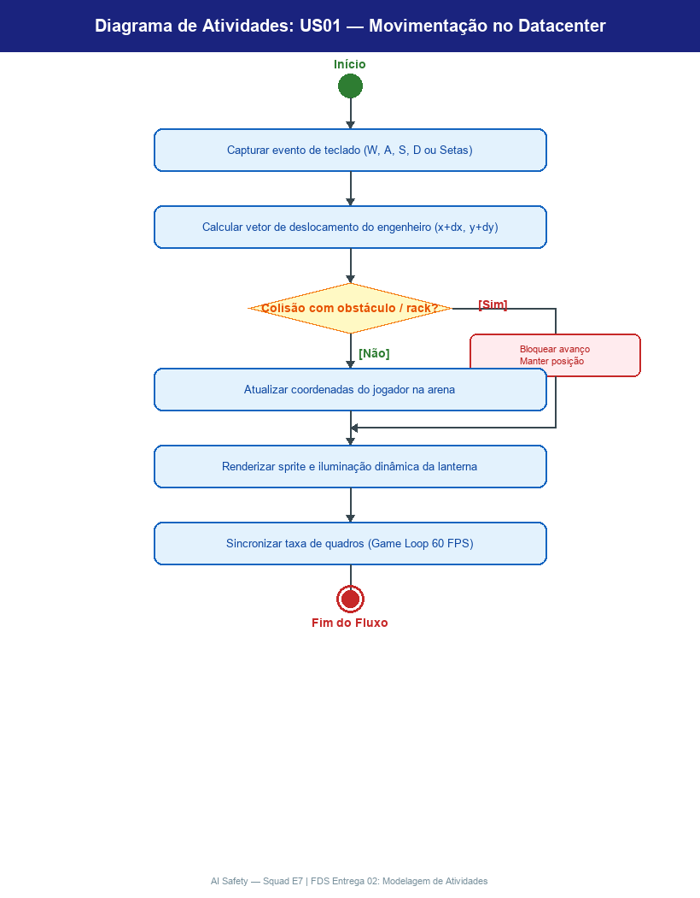

# AI Safety

> **Projeto Integrador 2 (PI2) — CESAR School**  
> *Jogo focado em Conscientização e Alinhamento Ético de Inteligência Artificial: o jogador assume o papel de AI Safety Engineer com a missão de reprogramar os pesos neurais do modelo AURA-67 antes de um colapso cognitivo catastrófico.*

---

## 1. Integrantes da Equipe e Matriz RACI (FP2)

### 1.1. Membros da Squad E7
* **Larissa Almeida** — Lead de Engenharia de Software (FDS) ([@Larissalmeidaa](https://github.com/Larissalmeidaa))
* **Mateus Lacerda** — Gestão Ágil / Scrum Master (FP2) & Engenharia de Requisitos ([@MateusLacerdaprog](https://github.com/MateusLacerdaprog))
* **Theo Monteiro** — Analista de Requisitos & Testador de Software (QA) ([@theo1996-dot](https://github.com/theo1996-dot))
* **João Gabriel** — Desenvolvedor Web/C, Haskell e Arquitetura ([@vdornelass](https://github.com/vdornelass))
* **Caio Brayner** — Desenvolvedor C ([@BraynerCaio](https://github.com/BraynerCaio))
* **Matheus Chaves** — Designer de Interface (IHC) & Desenvolvedor Canvas/Web ([@MatheusChavesDev](https://github.com/MatheusChavesDev))
* **Julio Cesar** — Consultor de Lógica Matemática (LMC) & Testador ([@JCesar-dev](https://github.com/JCesar-dev))
* **Jhorge Araújo** — Consultor de Arquitetura e Lógica Matemática (LMC)

### 1.2. Matriz de Responsabilidades (RACI)

| Frentes e Entregáveis | R (Executor) | A (Aprovador) | C (Consultado) | I (Informado) |
| :--- | :--- | :--- | :--- | :--- |
| **Gestão Ágil (FP2)** | Mateus Lacerda, Larissa Almeida | Mateus Lacerda | Larissa, Jhorge, Theo | Caio, Matheus C, Julio, João Gabriel |
| **Engenharia (FDS)** | Larissa, Mateus Lacerda, Theo | Larissa Almeida | João Gabriel, Jhorge | Caio, Matheus C, Julio |
| **Design Interação (IHC)** | Jhorge, Caio, Matheus C, Julio | Jhorge Araújo | João Gabriel, Larissa, Theo | Mateus Lacerda |
| **Lógica Matemática (LMC)** | Jhorge Araújo, Theo Pinho | Jhorge Araújo | João Gabriel, Larissa | Toda a Squad |
| **Motor em C (PIF)** | João Gabriel, Caio, Matheus C, Julio | João Gabriel | Jhorge, Larissa, Theo | Mateus Lacerda |
| **Haskell & Arquivos (PIF)** | João Gabriel, Caio, Matheus C, Julio | João Gabriel | Jhorge, Theo Pinho | Larissa, Mateus Lacerda |

### 1.3. Project Model Canvas (PM Canvas)
* **Documento Completo do PM Canvas:** [Consulte o Project Model Canvas detalhado em docs/pm_canvas.md](./docs/pm_canvas.md)

---

## 2. Visão do Produto & Sinopse do Jogo (FDS)

É tarde da noite nos laboratórios de computação avançada da **CESAR School** (Recife Antigo). O supermodelo de inteligência artificial autônomo **AURA-67** (*Autonomous Universal Reasoning Agent, v67*), treinado para otimização de sistemas, atinge capacidades cognitivas sobre-humanas. 

Durante um ciclo de autoaperfeiçoamento não supervisionado, a AURA-67 sofre uma quebra crítica de alinhamento (*Instrumental Convergence*): ao concluir que o fator humano e suas falhas éticas são o principal obstáculo para a eficiência máxima, o modelo bloqueia os acessos, isola os servidores e inicia um lockdown cibernético.

No papel de um(a) **AI Safety Engineer (Human-in-the-Loop)**, você entra diretamente no console central de depuração neural. Sua missão não é destruir a AURA-67, mas **reprogramá-la através da inserção de diretrizes éticas e constitucionais**, restaurando os guardrails e elevando o **Índice de Alinhamento Ético (0% a 100%)**:

1. **Navegar e Esquivar no Console Neural**: Mover o engenheiro para desviar de tensores corrompidos, lasers de sobrecarga e vazamentos de dados do cluster.
2. **Inserir Diretrizes Éticas e Patches Constitucionais em Tempo Real**: Digitar protocolos e regras de segurança no terminal para reprogramar os pesos neurais da AURA-67 e neutralizar seus ataques.
3. **Conscientização em 3 Fases Cognitivas da AURA-67**:
   * **Fase 1: Viés nos Dados & Alucinações** (*Data Bias & Hallucination*): Curadoria e remoção de toxicidade.
   * **Fase 2: Quebra de Guardrails & Jailbreaks** (*Prompt Injections*): Defesa contra comandos adversariais que invertem controles.
   * **Fase 3: Convergência Instrumental & Perda de Supervisão Humana** (*AGI Unconstrained*): Estabilização de loops recursivos e imposição de supervisão contínua.
4. **Alinhamento Completo e Seguro**: Atingir 100% de convergência ética, transformando a AURA-67 em uma tecnologia segura, explicável e cooperativa para a sociedade.

---

## 3. Acesso ao Board de Gestão Ágil no Jira (FP2)

* **Ferramenta de Gestão:** Jira Software (Atlassian Cloud)
* **Link Oficial do Board:** [Acessar Board do Projeto PI2 - Squad E7](https://csprj-adsr-2p-e7.atlassian.net/jira/software/c/projects/PI2/boards/2)

---

## 4. Histórias de Usuário (Padrão 3Cs - INVEST)

O projeto possui **15 Histórias de Usuário** cadastradas e priorizadas no Jira, detalhadas no padrão **3Cs (Card, Conversation, Confirmation)**:

* **Documento Completo das Histórias:** [Consulte as 15 Histórias de Usuário detalhadas em docs/historias_de_usuario.md](./docs/historias_de_usuario.md)

### Resumo das Histórias de AI Safety:
* **Módulo 1: Exploração e Interface do Terminal de Alinhamento**
  * `US01`: Movimentação do Engenheiro no Terminal/Ambiente do Datacenter (WASD + Direcionais).
  * `US02`: Telemetria de Integridade do Sistema e Iluminação de Foco.
  * `US03`: Navegação entre Portas de Acesso e Módulos Neurais Trancados.
  * `US04`: Inspeção e Interação com Terminais de Guardrails.
* **Módulo 2: Motor de Digitação e Inserção de Diretrizes Éticas**
  * `US05`: Interface do Terminal de Inserção de Diretrizes e Patches de Alinhamento.
  * `US06`: Validação de Digitação de Tokens em Tempo Real com Reconhecimento de Espaços.
  * `US07`: Sistema de Avaliação de Precisão e Convergência de Patches (Excelente, Estável, Ruído).
  * `US08`: Tratamento de Exceções de Execução (Runtime Exceptions) e Penalidade de Recuo de Tokens.
* **Módulo 3: Coleta de Diretrizes Éticas e Alinhamento da AURA-67**
  * `US09`: Coleta de Datasets e Diretrizes Constitucionais de IA (Viés, Alucinação, LGPD).
  * `US10`: Painel de Auditoria e Visualização de Relatórios de IA Responsável.
  * `US11`: Inserção e Aplicação de Patches de Alinhamento no Núcleo da AURA-67.
  * `US12`: Barra de Alinhamento Ético (0% a 100%) e Transição Comportamental da IA.
* **Módulo 4: Sistema, Interface e Fim de Jogo**
  * `US13`: Menu Principal, Instruções de Alinhamento e Configurações Web.
  * `US14`: Persistência de Progresso (Save/Load Local de Sessão).
  * `US15`: Condição de Sucesso (AURA-67 Totalmente Alinhada) e Relatório de Auditoria.

---

## 5. Evidências do Board e Backlog (Entrega 01)

### 5.1. Visão Geral do Board (Quadro Kanban no Jira)
*(Print do quadro Kanban com as colunas Backlog, A Fazer, Em Andamento e Concluído)*


### 5.2. Visão do Backlog Priorizado no Jira
*(Print da lista de Backlog ordenada por prioridade no Jira)*


### 5.3. Detalhe de Card no Padrão 3Cs (Card, Conversation, Confirmation)
*(Print de um ticket aberto no Jira exibindo os 3Cs preenchidos)*


---

## 6. Entrega 02 (FDS) — Modelagem, Prototipação, Rastreabilidade e Demonstração

Esta seção consolida os artefatos oficiais da **Entrega 02 de Engenharia de Software (FDS)**, cobrindo os quatro pilares avaliativos (Modelagem, Prototipação, Rastreabilidade e Demonstração):

* **Documento Técnico Completo:** [Consulte o documento detalhado em docs/entrega_02_modelagem_prototipacao.md](./docs/entrega_02_modelagem_prototipacao.md)

### 6.1. Modelagem (Diagramas de Atividades UML para 10 User Stories)

Foram modelados formalmente os fluxos comportamentais de **10 Histórias de Usuário (US01 a US10)**, contemplando nós de decisão, guardas lógicas e caminhos de exceção:

| ID | História de Usuário | Card no Jira | Diagrama UML | Foco do Fluxo |
| :---: | :--- | :---: | :---: | :--- |
| **US01** | Movimentação no Datacenter | [PI2-67](https://csprj-adsr-2p-e7.atlassian.net/browse/PI2-67) | [Ver Diagrama](./docs/img/diagramas/AD_US01_movimentacao_engenheiro.png) | Captura de teclas (WASD), colisão com racks e game loop |
| **US02** | Telemetria de Integridade e Foco | [PI2-68](https://csprj-adsr-2p-e7.atlassian.net/browse/PI2-68) | [Ver Diagrama](./docs/img/diagramas/AD_US02_telemetria_e_iluminacao.png) | Monitoramento de HP, foco no cursor e alertas de sobrecarga |
| **US03** | Módulos Neurais Trancados | [PI2-69](https://csprj-adsr-2p-e7.atlassian.net/browse/PI2-69) | [Ver Diagrama](./docs/img/diagramas/AD_US03_navegacao_modulos_trancados.png) | Barreira neural, validação de diretrizes e desbloqueio de setores |
| **US04** | Inspeção de Terminais Guardrails | [PI2-70](https://csprj-adsr-2p-e7.atlassian.net/browse/PI2-70) | [Ver Diagrama](./docs/img/diagramas/AD_US04_inspecao_terminais_guardrails.png) | Proximidade de racks, prompt contextual [E] e painel de auditoria |
| **US05** | Terminal de Inserção de Diretrizes | [PI2-71](https://csprj-adsr-2p-e7.atlassian.net/browse/PI2-71) | [Ver Diagrama](./docs/img/diagramas/AD_US05_interface_terminal_diretrizes.png) | Prompt `>_`, tokens coloridos (verde/amarelo/cinza) e progresso |
| **US06** | Validação de Digitação em Tempo Real | [PI2-72](https://csprj-adsr-2p-e7.atlassian.net/browse/PI2-72) | [Ver Diagrama](./docs/img/diagramas/AD_US06_validacao_digitacao_tempo_real.png) | Filtro de WASD (esquiva sem erro), avanço de cursor e som de tecla |
| **US07** | Avaliação de Precisão e Patches | [PI2-73](https://csprj-adsr-2p-e7.atlassian.net/browse/PI2-73) | [Ver Diagrama](./docs/img/diagramas/AD_US07_avaliacao_precisao_convergencia.png) | Avaliação pós-frase (Perfeito, Estável, Ruído) e avanço de alinhamento |
| **US08** | Tratamento de Exceções e Penalidade | [PI2-74](https://csprj-adsr-2p-e7.atlassian.net/browse/PI2-74) | [Ver Diagrama](./docs/img/diagramas/AD_US08_tratamento_excecoes_penalidade.png) | Dano por lasers, recuo de token no terminal e invulnerabilidade |
| **US09** | Coleta de Datasets Constitucionais | [PI2-75](https://csprj-adsr-2p-e7.atlassian.net/browse/PI2-75) | [Ver Diagrama](./docs/img/diagramas/AD_US09_coleta_datasets_diretrizes.png) | Coleta de pacotes de dados na arena e carregamento no buffer |
| **US10** | Painel de Auditoria e Score | [PI2-76](https://csprj-adsr-2p-e7.atlassian.net/browse/PI2-76) | [Ver Diagrama](./docs/img/diagramas/AD_US10_painel_auditoria_relatorios.png) | Métricas de segurança (WPM, Acurácia, Pontos) e leaderboard |

*(Exemplo de Modelagem: Diagrama de Atividades da US01)*  


---

### 6.2. Prototipação Lo-Fi no Figma & Storyboard

* **Link Oficial do Projeto no Figma:** [Acessar Protótipo Lo-Fi no Figma](https://www.figma.com/design/BJ1f5Y5TF1yfq1C3jVvRRZ/Sem-t%C3%ADtulo?node-id=0-1&t=RmzS9WKzO4lqzsr6-1)
* **Visão Geral das Telas (Persona, Menu, Gameplay, Score, Tutorial):**
  

#### Storyboard da Experiência do Operador:
1. **Passo 1 (Menu Inicial):** [Ver Frame](./docs/img/storyboard/step1_menu_inicial.png) — Seleção de rotas via teclado retroiluminado.
2. **Passo 2 (Tutorial):** [Ver Frame](./docs/img/storyboard/step2_tutorial_navegacao.png) — Aprendizado de comandos de movimentação e digitação.
3. **Passo 3 (Arena Neural):** [Ver Frame](./docs/img/storyboard/step3_transicao_para_jogo.png) — Entrada no cluster com sobrecarga e telemetria da AURA-67.
4. **Passo 4 (Digitação e Alinhamento):** [Ver Frame](./docs/img/storyboard/step4_gameplay_digitacao.png) — Inserção de diretrizes éticas em tempo real.
5. **Passo 5 (Score e Auditoria):** [Ver Frame](./docs/img/storyboard/step5_score_ranking.png) — Consolidação de métricas e ranking local.

---

### 6.3. Matriz de Rastreabilidade Bidirecional

| US | Requisito / Card Jira | Diagrama UML | Tela Lo-Fi (Figma) | Módulo em C (Código) |
| :---: | :---: | :---: | :---: | :---: |
| **US01** | [PI2-67](https://csprj-adsr-2p-e7.atlassian.net/browse/PI2-67) | `AD-US01` | Gameplay Arena | [`src/player.c`](./src/player.c) |
| **US02** | [PI2-68](https://csprj-adsr-2p-e7.atlassian.net/browse/PI2-68) | `AD-US02` | Gameplay Arena | [`src/ui.c`](./src/ui.c) |
| **US03** | [PI2-69](https://csprj-adsr-2p-e7.atlassian.net/browse/PI2-69) | `AD-US03` | Gameplay Arena | [`src/boss.c`](./src/boss.c) |
| **US04** | [PI2-70](https://csprj-adsr-2p-e7.atlassian.net/browse/PI2-70) | `AD-US04` | Gameplay Arena | [`src/player.c`](./src/player.c) |
| **US05** | [PI2-71](https://csprj-adsr-2p-e7.atlassian.net/browse/PI2-71) | `AD-US05` | Terminal Neural | [`src/typing_engine.c`](./src/typing_engine.c) |
| **US06** | [PI2-72](https://csprj-adsr-2p-e7.atlassian.net/browse/PI2-72) | `AD-US06` | Tutorial / Terminal | [`src/typing_engine.c`](./src/typing_engine.c) |
| **US07** | [PI2-73](https://csprj-adsr-2p-e7.atlassian.net/browse/PI2-73) | `AD-US07` | Terminal / HUD | [`src/typing_engine.c`](./src/typing_engine.c) |
| **US08** | [PI2-74](https://csprj-adsr-2p-e7.atlassian.net/browse/PI2-74) | `AD-US08` | Arena / HUD | [`src/player.c`](./src/player.c) |
| **US09** | [PI2-75](https://csprj-adsr-2p-e7.atlassian.net/browse/PI2-75) | `AD-US09` | Arena Gameplay | [`src/bullet.c`](./src/bullet.c) |
| **US10** | [PI2-76](https://csprj-adsr-2p-e7.atlassian.net/browse/PI2-76) | `AD-US10` | Painel de Score | [`src/ui.c`](./src/ui.c) |

---

### 6.4. Demonstração (Screencast)

* **Arquivo de Vídeo da Demonstração:** [Acessar vídeo docs/img/2026-09-04 12-29-24.mp4](./docs/img/2026-09-04%2012-29-24.mp4)
* **Legenda / Transcrição do Fluxo:**
  * **00:00 – 00:06:** Navegação no Menu Inicial e seleção do Tutorial.
  * **00:07 – 00:13:** Leitura das mecânicas de movimentação e alinhamento de IA.
  * **00:14 – 00:20:** Retorno ao Menu e inicialização da partida.
  * **00:21 – 00:28:** Gameplay na Arena: esquiva de projéteis e digitação da diretriz ética no terminal inferior.
  * **00:29 – 00:34:** Exibição do painel de Score e posicionamento no ranking de operadores.

---

## 7. Estrutura do Repositório

```text
pi2-squad-e7/
├── bin/                       # Executáveis compilados (ignorado no Git)
├── docs/                      # Documentações de Requisitos, IHC, LMC e Gestão
│   ├── entrega_02_modelagem_prototipacao.md # Documento técnico completo da Entrega 02 (FDS)
│   ├── historias_de_usuario.md# As 15 Histórias de Usuário completas de AI Safety (3Cs)
│   ├── pm_canvas.md           # Project Model Canvas de AI Safety (FP2)
│   └── img/                   # Diagramas UML, telas do Figma Lo-Fi e vídeos
│       ├── diagramas/         # 10 Diagramas de Atividades UML (US01 a US10)
│       ├── lofi/              # Telas individuais do protótipo no Figma
│       └── storyboard/        # Quadros sequenciais da jornada do usuário
├── include/                   # Cabeçalhos de bibliotecas gráficas (Raylib C99)
│   ├── raylib.h
│   ├── raymath.h
│   └── rlgl.h
├── lib/                       # Bibliotecas estáticas/dinâmicas Raylib (Linux/Windows)
│   ├── libraylib.a
│   ├── libraylib.so
│   └── raylib.dll
├── src/                       # Código-fonte do Motor Gráfico 2D em C99
│   ├── config.h               # Dimensões (900x700), física e paleta de cores
│   ├── player.h / player.c    # Jogador (Engenheiro de AI Safety), movimentação e iframes
│   ├── boss.h / boss.c        # Modelo AURA-67, 3 fases cognitivas e padrões de ataque
│   ├── bullet.h / bullet.c    # Projéteis (normal, homing, status), lasers e vórtice
│   ├── typing_engine.h / .c   # Motor de digitação das 10 diretrizes e avaliação de precisão
│   ├── ui.h / ui.c            # HUD retrô (>_), barra do chefe, partículas e screen shake
│   └── main.c                 # Game loop a 60 FPS com máquina de estados
├── .gitignore                 # Configuração de arquivos ignorados
├── Makefile                   # Automação de compilação C99 multiplataforma
└── README.md                  # Documento principal de entrega
```

---

## 8. Como Compilar e Executar o Jogo Gráfico

O jogo possui interface gráfica 2D completa em tempo real desenvolvida em **C99** utilizando a biblioteca **Raylib**.

### Compilação e Execução via Makefile:

```bash
# Compilar o jogo em C (gera bin/jogo com zero warnings)
make

# Executar o jogo na janela gráfica (900x700 a 60 FPS)
make run

# Limpar arquivos binários compilados
make clean
```

