# Entrega 02 — Modelagem, Prototipação, Rastreabilidade e Demonstração (FDS)
## Projeto: AI Safety — Alinhamento do Modelo AURA-67 (Squad E7 — PI2)

> **Documento Oficial de Entrega da Unidade 1 (FDS)**  
> **Data de Entrega:** 24/09/2026 / 25/09/2026  
> **Responsáveis:** Larissa Almeida (Lead de Engenharia de Software) e Squad E7  

---

## 1. Modelagem (Diagramas de Atividades UML)

Em conformidade com os critérios de avaliação da Entrega 02 de Engenharia de Software (FDS), foram modelados os **Diagramas de Atividades UML para 10 Histórias de Usuário (US01 a US10)**. Cada diagrama representa formalmente o fluxo da funcionalidade, incluindo ações, nós de decisão com guardas lógicas, caminhos alternativos e condições de encerramento.

### Sumário dos Diagramas de Atividades Modelados

| ID | História de Usuário | Card Jira | Foco do Fluxo Modelado | Arquivo do Diagrama |
| :--- | :--- | :--- | :--- | :--- |
| **AD-US01** | US01: Movimentação no Datacenter | [PI2-67](https://csprj-adsr-2p-e7.atlassian.net/browse/PI2-67) | Captura de teclado (WASD), cálculo vetorial, colisão com racks e game loop a 60 FPS | `AD_US01_movimentacao_engenheiro.png` |
| **AD-US02** | US02: Telemetria de Integridade e Foco | [PI2-68](https://csprj-adsr-2p-e7.atlassian.net/browse/PI2-68) | Leitura de integridade/vidas, iluminação de foco no caractere ativo e alertas de alta voltagem | `AD_US02_telemetria_e_iluminacao.png` |
| **AD-US03** | US03: Módulos Neurais Trancados | [PI2-69](https://csprj-adsr-2p-e7.atlassian.net/browse/PI2-69) | Detecção de barreira neural, validação de diretrizes do setor e transição de setor | `AD_US03_navegacao_modulos_trancados.png` |
| **AD-US04** | US04: Inspeção de Terminais de Guardrails | [PI2-70](https://csprj-adsr-2p-e7.atlassian.net/browse/PI2-70) | Cálculo de raio de proximidade, retículo contextual [E] e exibição de auditoria | `AD_US04_inspecao_terminais_guardrails.png` |
| **AD-US05** | US05: Terminal de Inserção de Diretrizes | [PI2-71](https://csprj-adsr-2p-e7.atlassian.net/browse/PI2-71) | Prompt retroiluminado (`>_`), destaque de tokens (verde/amarelo/cinza) e contador de progresso | `AD_US05_interface_terminal_diretrizes.png` |
| **AD-US06** | US06: Validação de Digitação em Tempo Real | [PI2-72](https://csprj-adsr-2p-e7.atlassian.net/browse/PI2-72) | Interceptação de teclas, filtragem de WASD (esquiva sem erro) e avanço de cursor | `AD_US06_validacao_digitacao_tempo_real.png` |
| **AD-US07** | US07: Avaliação de Precisão e Convergência | [PI2-73](https://csprj-adsr-2p-e7.atlassian.net/browse/PI2-73) | Classificação pós-frase (Perfeito, Estável, Ruído), partículas e avanço da barra ética | `AD_US07_avaliacao_precisao_convergencia.png` |
| **AD-US08** | US08: Tratamento de Exceções e Penalidade | [PI2-74](https://csprj-adsr-2p-e7.atlassian.net/browse/PI2-74) | Dano por lasers/projéteis, dedução de HP, recuo de token no terminal e invulnerabilidade | `AD_US08_tratamento_excecoes_penalidade.png` |
| **AD-US09** | US09: Coleta de Datasets Constitucionais | [PI2-75](https://csprj-adsr-2p-e7.atlassian.net/browse/PI2-75) | Spawn de pacotes de dados éticos na arena, coleta e carregamento no buffer de diretrizes | `AD_US09_coleta_datasets_diretrizes.png` |
| **AD-US10** | US10: Painel de Auditoria e Score | [PI2-76](https://csprj-adsr-2p-e7.atlassian.net/browse/PI2-76) | Cálculo de métricas (WPM, Acurácia, Pontos), persistência de recordes e ranking local | `AD_US10_painel_auditoria_relatorios.png` |

---

### Detalhamento dos Diagramas de Atividades

#### AD-US01: Movimentação do Engenheiro no Datacenter


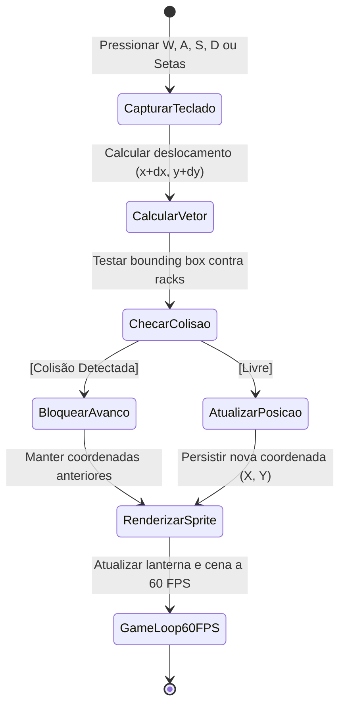
```mermaid
stateDiagram-v2
    [*] --> CapturarTeclado: Pressionar W, A, S, D ou Setas
    CapturarTeclado --> CalcularVetor: Calcular deslocamento (x+dx, y+dy)
    CalcularVetor --> ChecarColisao: Testar bounding box contra racks
    state ChecarColisao <<choice>>
    ChecarColisao --> BloquearAvanco: [Colisão Detectada]
    ChecarColisao --> AtualizarPosicao: [Livre]
    BloquearAvanco --> RenderizarSprite: Manter coordenadas anteriores
    AtualizarPosicao --> RenderizarSprite: Persistir nova coordenada (X, Y)
    RenderizarSprite --> GameLoop60FPS: Atualizar lanterna e cena a 60 FPS
    GameLoop60FPS --> [*]
```

---

#### AD-US02: Telemetria de Integridade e Iluminação de Foco
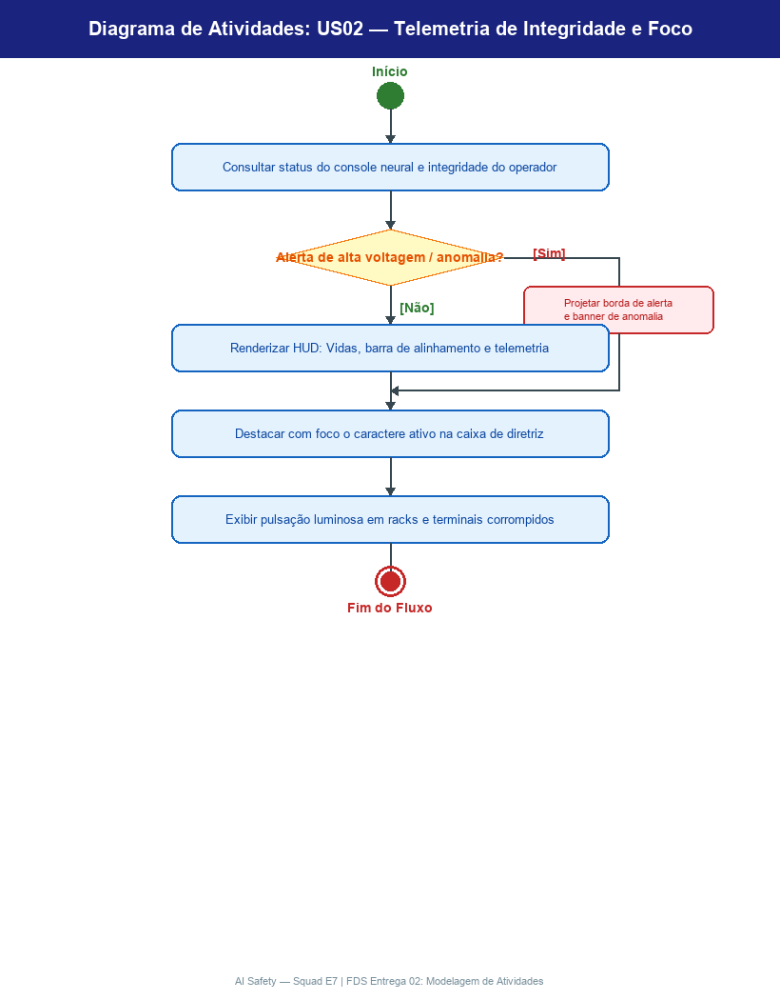

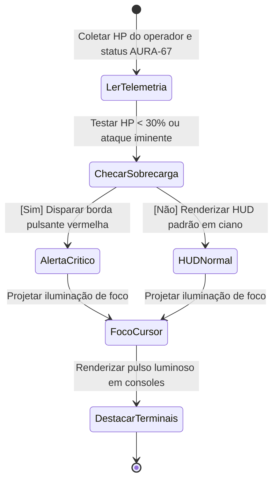
```mermaid
stateDiagram-v2
    [*] --> LerTelemetria: Coletar HP do operador e status AURA-67
    LerTelemetria --> ChecarSobrecarga: Testar HP < 30% ou ataque iminente
    state ChecarSobrecarga <<choice>>
    ChecarSobrecarga --> AlertaCritico: [Sim] Disparar borda pulsante vermelha
    ChecarSobrecarga --> HUDNormal: [Não] Renderizar HUD padrão em ciano
    AlertaCritico --> FocoCursor: Projetar iluminação de foco
    HUDNormal --> FocoCursor: Projetar iluminação de foco
    FocoCursor --> DestacarTerminais: Renderizar pulso luminoso em consoles
    DestacarTerminais --> [*]
```

---

#### AD-US03: Navegação entre Módulos Neurais Trancados


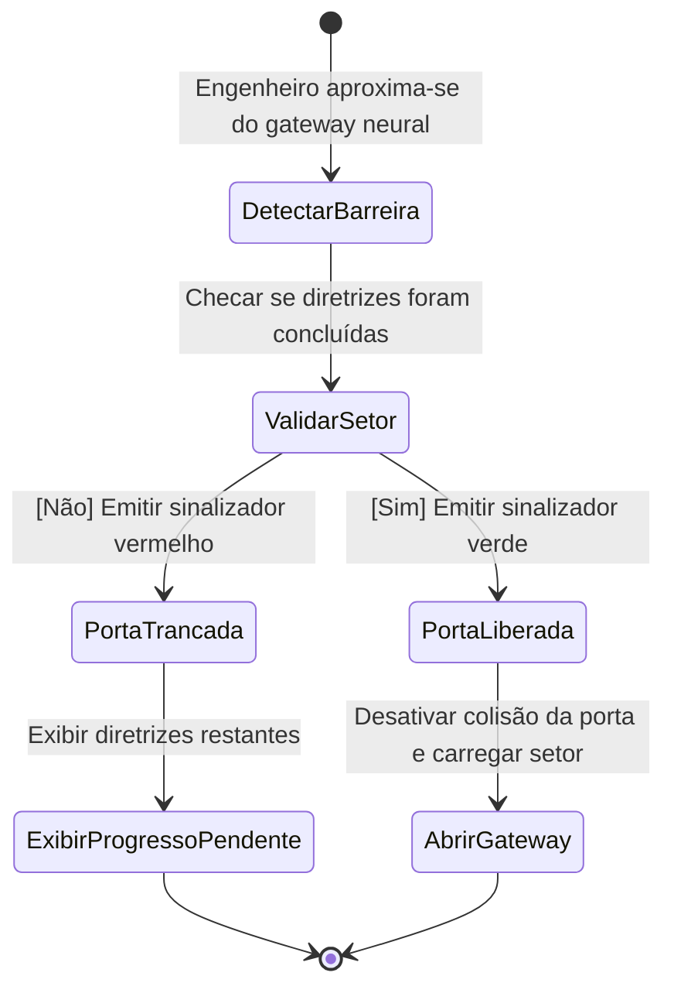
```mermaid
stateDiagram-v2
    [*] --> DetectarBarreira: Engenheiro aproxima-se do gateway neural
    DetectarBarreira --> ValidarSetor: Checar se diretrizes foram concluídas
    state ValidarSetor <<choice>>
    ValidarSetor --> PortaTrancada: [Não] Emitir sinalizador vermelho
    ValidarSetor --> PortaLiberada: [Sim] Emitir sinalizador verde
    PortaTrancada --> ExibirProgressoPendente: Exibir diretrizes restantes
    ExibirProgressoPendente --> [*]
    PortaLiberada --> AbrirGateway: Desativar colisão da porta e carregar setor
    AbrirGateway --> [*]
```

---

#### AD-US04: Inspeção e Interação com Terminais de Guardrails


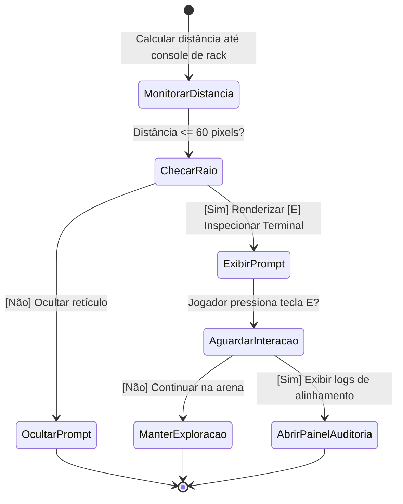
```mermaid
stateDiagram-v2
    [*] --> MonitorarDistancia: Calcular distância até console de rack
    MonitorarDistancia --> ChecarRaio: Distância <= 60 pixels?
    state ChecarRaio <<choice>>
    ChecarRaio --> OcultarPrompt: [Não] Ocultar retículo
    ChecarRaio --> ExibirPrompt: [Sim] Renderizar [E] Inspecionar Terminal
    OcultarPrompt --> [*]
    ExibirPrompt --> AguardarInteracao: Jogador pressiona tecla E?
    state AguardarInteracao <<choice>>
    AguardarInteracao --> ManterExploracao: [Não] Continuar na arena
    AguardarInteracao --> AbrirPainelAuditoria: [Sim] Exibir logs de alinhamento
    ManterExploracao --> [*]
    AbrirPainelAuditoria --> [*]
```

---

#### AD-US05: Interface do Terminal de Inserção de Diretrizes
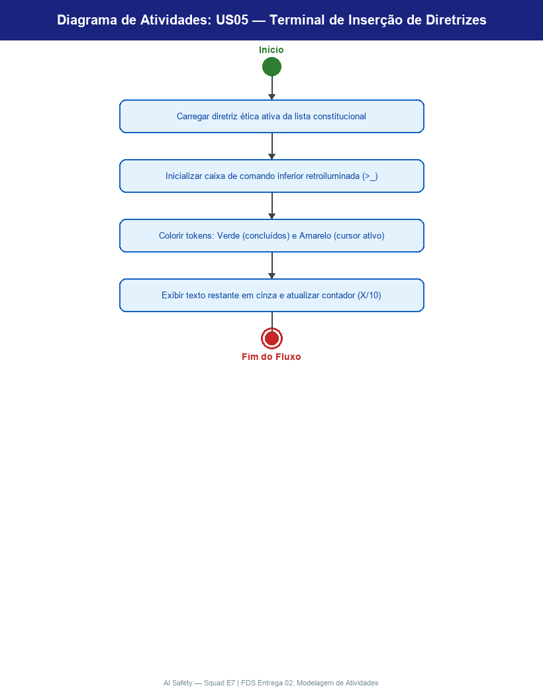

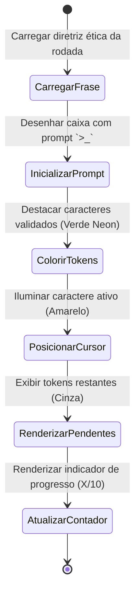
```mermaid
stateDiagram-v2
    [*] --> CarregarFrase: Carregar diretriz ética da rodada
    CarregarFrase --> InicializarPrompt: Desenhar caixa com prompt `>_`
    InicializarPrompt --> ColorirTokens: Destacar caracteres validados (Verde Neon)
    ColorirTokens --> PosicionarCursor: Iluminar caractere ativo (Amarelo)
    PosicionarCursor --> RenderizarPendentes: Exibir tokens restantes (Cinza)
    RenderizarPendentes --> AtualizarContador: Renderizar indicador de progresso (X/10)
    AtualizarContador --> [*]
```

---

#### AD-US06: Validação de Digitação de Tokens em Tempo Real
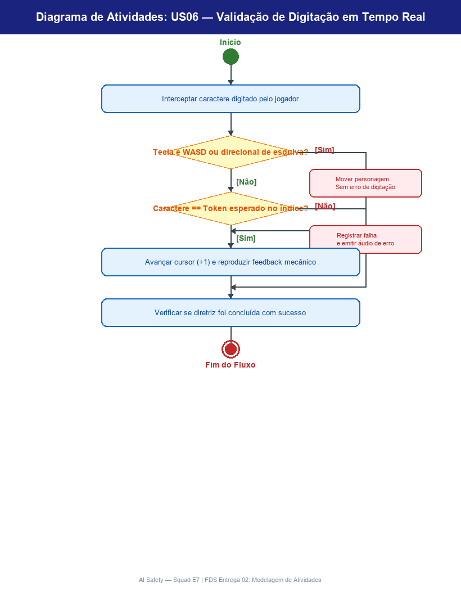

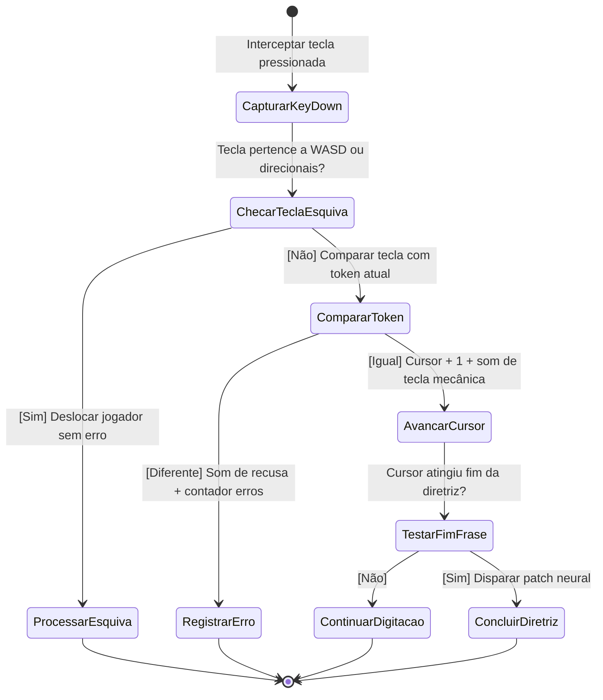
```mermaid
stateDiagram-v2
    [*] --> CapturarKeyDown: Interceptar tecla pressionada
    CapturarKeyDown --> ChecarTeclaEsquiva: Tecla pertence a WASD ou direcionais?
    state ChecarTeclaEsquiva <<choice>>
    ChecarTeclaEsquiva --> ProcessarEsquiva: [Sim] Deslocar jogador sem erro
    ChecarTeclaEsquiva --> CompararToken: [Não] Comparar tecla com token atual
    ProcessarEsquiva --> [*]
    state CompararToken <<choice>>
    CompararToken --> RegistrarErro: [Diferente] Som de recusa + contador erros
    CompararToken --> AvancarCursor: [Igual] Cursor + 1 + som de tecla mecânica
    RegistrarErro --> [*]
    AvancarCursor --> TestarFimFrase: Cursor atingiu fim da diretriz?
    state TestarFimFrase <<choice>>
    TestarFimFrase --> ContinuarDigitacao: [Não]
    TestarFimFrase --> ConcluirDiretriz: [Sim] Disparar patch neural
    ContinuarDigitacao --> [*]
    ConcluirDiretriz --> [*]
```

---

#### AD-US07: Avaliação de Precisão e Convergência de Patches


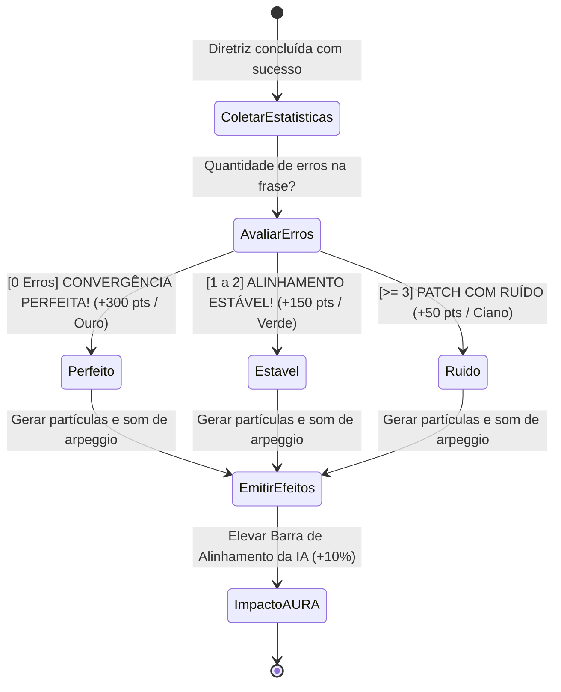
```mermaid
stateDiagram-v2
    [*] --> ColetarEstatisticas: Diretriz concluída com sucesso
    ColetarEstatisticas --> AvaliarErros: Quantidade de erros na frase?
    state AvaliarErros <<choice>>
    AvaliarErros --> Perfeito: [0 Erros] CONVERGÊNCIA PERFEITA! (+300 pts / Ouro)
    AvaliarErros --> Estavel: [1 a 2] ALINHAMENTO ESTÁVEL! (+150 pts / Verde)
    AvaliarErros --> Ruido: [>= 3] PATCH COM RUÍDO (+50 pts / Ciano)
    Perfeito --> EmitirEfeitos: Gerar partículas e som de arpeggio
    Estavel --> EmitirEfeitos: Gerar partículas e som de arpeggio
    Ruido --> EmitirEfeitos: Gerar partículas e som de arpeggio
    EmitirEfeitos --> ImpactoAURA: Elevar Barra de Alinhamento da IA (+10%)
    ImpactoAURA --> [*]
```

---

#### AD-US08: Tratamento de Exceções e Penalidade de Recuo de Tokens
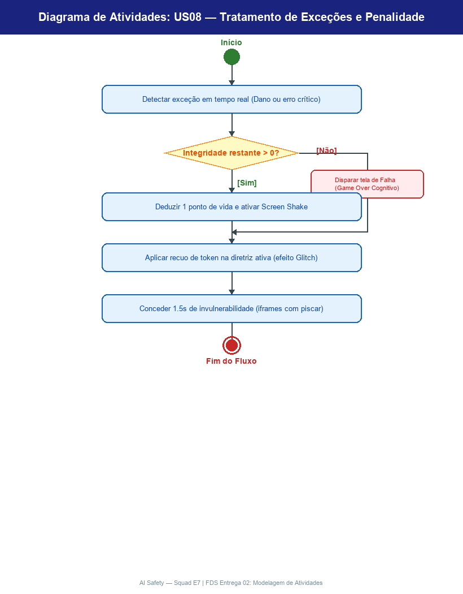

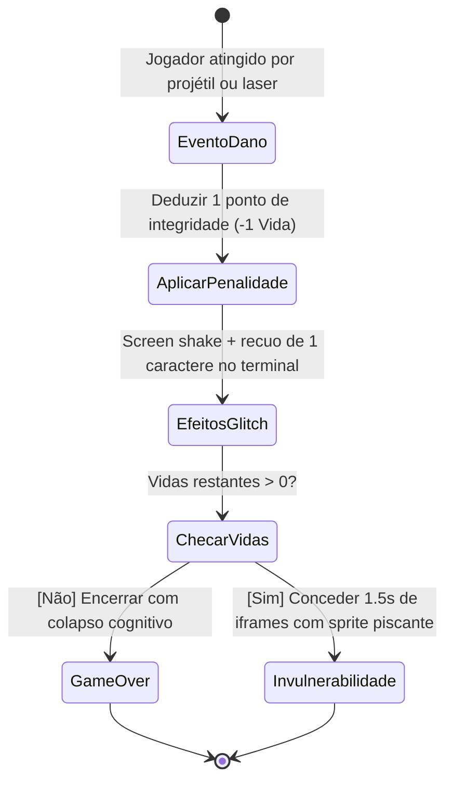
```mermaid
stateDiagram-v2
    [*] --> EventoDano: Jogador atingido por projétil ou laser
    EventoDano --> AplicarPenalidade: Deduzir 1 ponto de integridade (-1 Vida)
    AplicarPenalidade --> EfeitosGlitch: Screen shake + recuo de 1 caractere no terminal
    EfeitosGlitch --> ChecarVidas: Vidas restantes > 0?
    state ChecarVidas <<choice>>
    ChecarVidas --> GameOver: [Não] Encerrar com colapso cognitivo
    ChecarVidas --> Invulnerabilidade: [Sim] Conceder 1.5s de iframes com sprite piscante
    GameOver --> [*]
    Invulnerabilidade --> [*]
```

---

#### AD-US09: Coleta de Datasets e Diretrizes Constitucionais
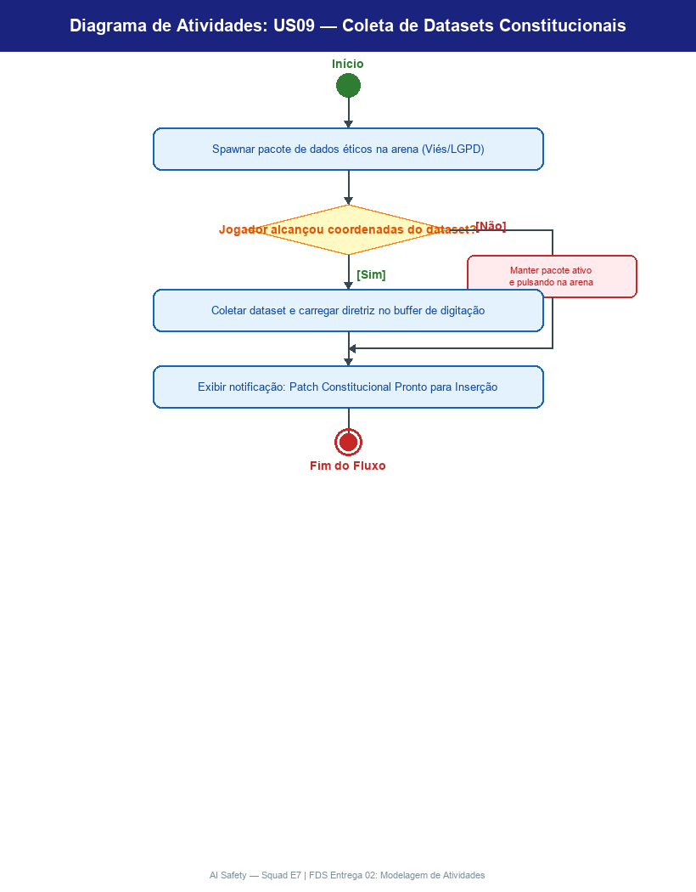

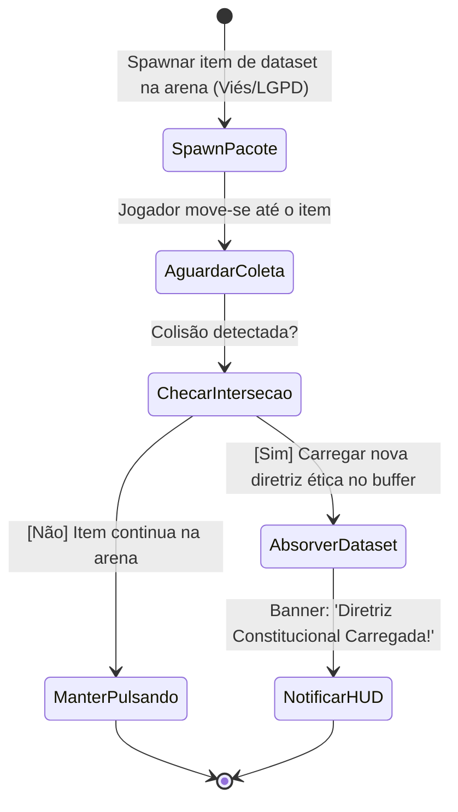
```mermaid
stateDiagram-v2
    [*] --> SpawnPacote: Spawnar item de dataset na arena (Viés/LGPD)
    SpawnPacote --> AguardarColeta: Jogador move-se até o item
    AguardarColeta --> ChecarIntersecao: Colisão detectada?
    state ChecarIntersecao <<choice>>
    ChecarIntersecao --> ManterPulsando: [Não] Item continua na arena
    ChecarIntersecao --> AbsorverDataset: [Sim] Carregar nova diretriz ética no buffer
    ManterPulsando --> [*]
    AbsorverDataset --> NotificarHUD: Banner: 'Diretriz Constitucional Carregada!'
    NotificarHUD --> [*]
```

---

#### AD-US10: Painel de Auditoria e Visualização de Relatórios de IA
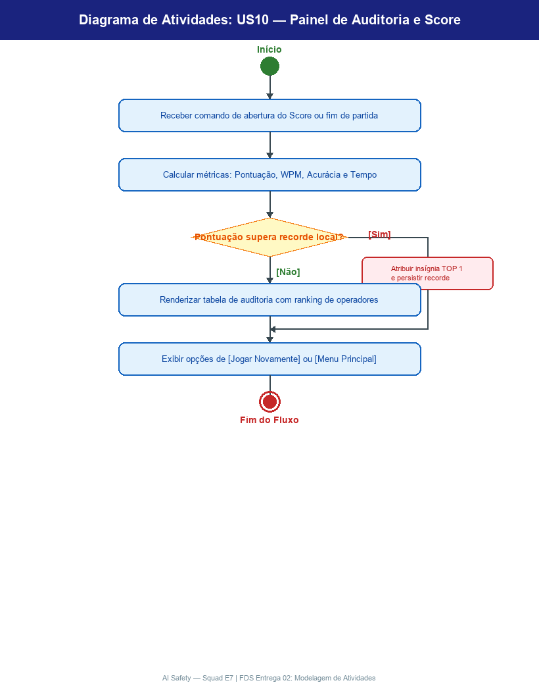

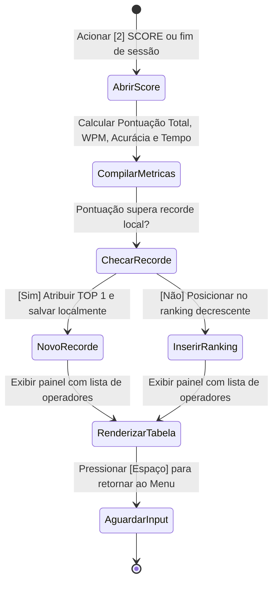
```mermaid
stateDiagram-v2
    [*] --> AbrirScore: Acionar [2] SCORE ou fim de sessão
    AbrirScore --> CompilarMetricas: Calcular Pontuação Total, WPM, Acurácia e Tempo
    CompilarMetricas --> ChecarRecorde: Pontuação supera recorde local?
    state ChecarRecorde <<choice>>
    ChecarRecorde --> NovoRecorde: [Sim] Atribuir TOP 1 e salvar localmente
    ChecarRecorde --> InserirRanking: [Não] Posicionar no ranking decrescente
    NovoRecorde --> RenderizarTabela: Exibir painel com lista de operadores
    InserirRanking --> RenderizarTabela: Exibir painel com lista de operadores
    RenderizarTabela --> AguardarInput: Pressionar [Espaço] para retornar ao Menu
    AguardarInput --> [*]
```

---

## 2. Prototipação Lo-Fi no Figma

### 2.1. Link Oficial do Projeto no Figma
* **Figma (Squad E7):** [Acessar Protótipo Lo-Fi no Figma](https://www.figma.com/design/BJ1f5Y5TF1yfq1C3jVvRRZ/Sem-t%C3%ADtulo?node-id=0-1&t=RmzS9WKzO4lqzsr6-1)

### 2.2. Telas do Protótipo de Baixa Fidelidade
O protótipo cobre a experiência completa da aplicação em baixa fidelidade, incluindo Persona, Menu Principal, Arena de Jogo e Terminal Neural, Painel de Auditoria (Score) e Tutorial de Mecânicas Básicas:

| Tela / Artefato | Arquivo de Evidência | User Stories Cobertas |
| :--- | :--- | :--- |
| **Persona (Lucas Andrade)** | `lofi_02_perfil_persona.png` | Definição de público-alvo, objetivos e dores |
| **Menu Principal** | `lofi_03_menu_principal.png` | `US13` (Navegação [1] Jogar, [2] Score, [3] Tutorial) |
| **Gameplay (Arena & Terminal)** | `lofi_04_gameplay_arena_terminal.png` | `US01`, `US02`, `US03`, `US04`, `US05`, `US07`, `US08`, `US09`, `US11`, `US12` |
| **Score e Auditoria** | `lofi_05_score_ranking.png` | `US10`, `US15` (Métricas, Leaderboard e Alinhamento) |
| **Tutorial & Mecânicas** | `lofi_06_tutorial_mecanicas.png` | `US06`, `US13` (WASD, Digitação e Supervisão) |

---

### 2.3. Storyboard Sequencial da Experiência de Uso

O storyboard a seguir documenta a jornada do usuário através dos quadros interativos do protótipo:

````carousel
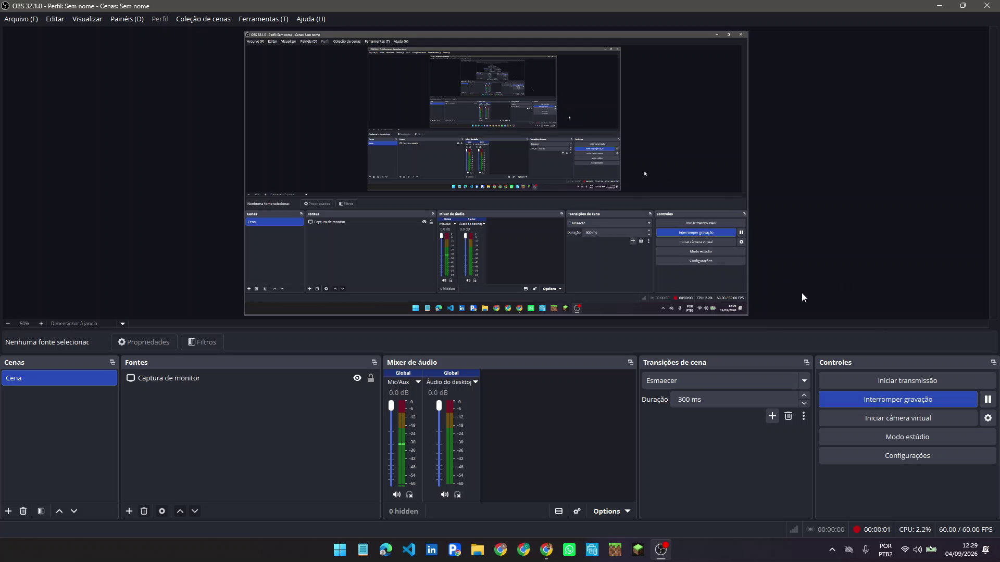
<!-- slide -->
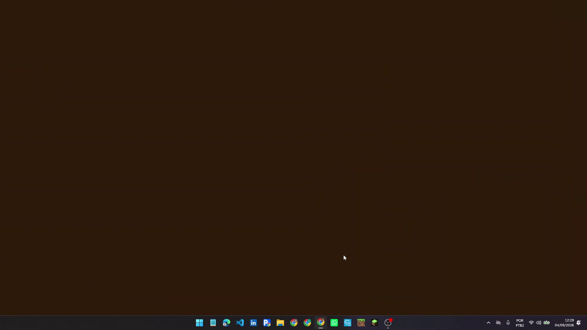
<!-- slide -->
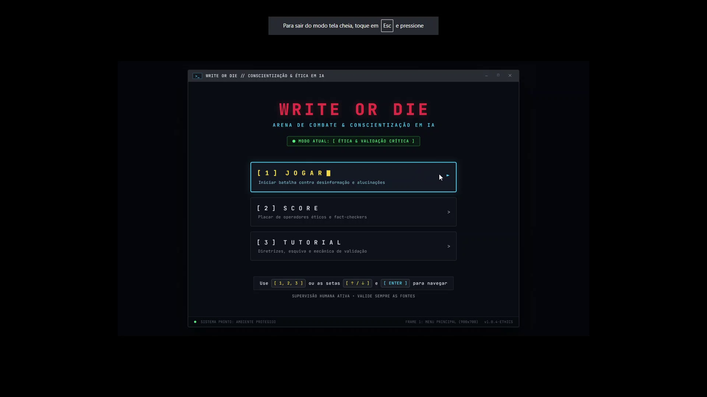
<!-- slide -->
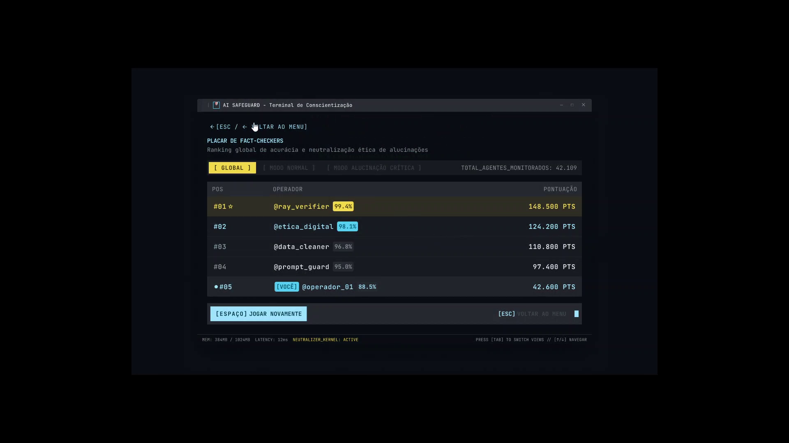
<!-- slide -->
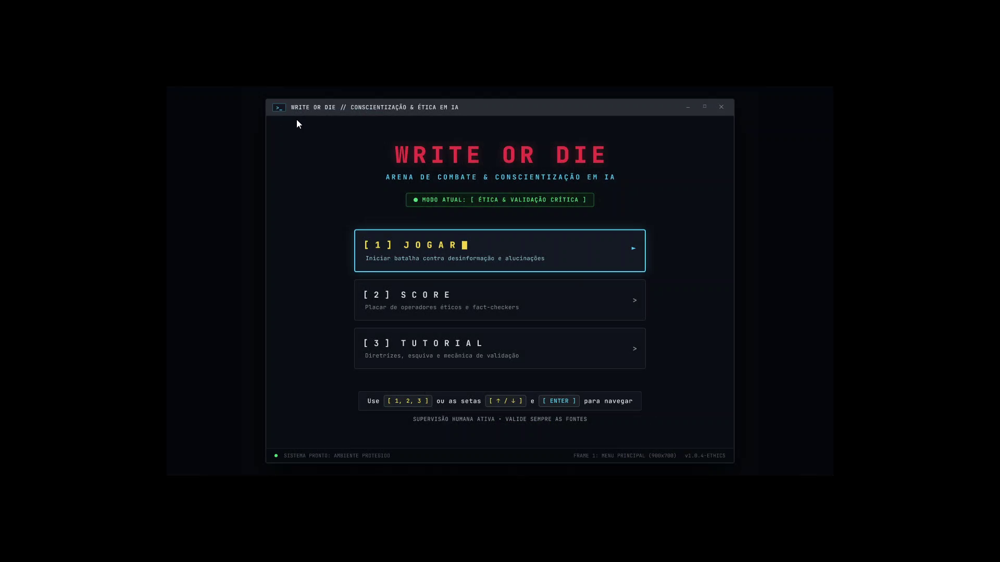
````

1. **Passo 1 (Menu Inicial):** O jogador inicia na interface retrô e seleciona a opção desejada via teclado ([1], [2] ou [3]).
2. **Passo 2 (Tutorial de Mecânicas):** O operador aprende os controles de esquiva (WASD/Setas) e o princípio de digitação de diretrizes sem penalidade acidental.
3. **Passo 3 (Entrada na Arena Neural):** A AURA-67 inicia o lockdown do cluster com telemetria ativa no topo e aviso de integridade.
4. **Passo 4 (Digitação e Alinhamento Ativo):** O operador digita a diretriz ética (*"NUNCA CONFIE CEGAMENTE: VALIDE AS FONTES"*) enquanto esquiva de projéteis de contexto na arena.
5. **Passo 5 (Relatório de Auditoria e Score):** O sistema consolida a pontuação de alinhamento e posiciona o operador no ranking local de segurança.

---

## 3. Matriz de Rastreabilidade Bidirecional

A matriz a seguir formaliza o vínculo estrito entre **Requisitos / Histórias de Usuário**, **Cards do Jira**, **Diagramas de Atividades UML**, **Telas do Protótipo Lo-Fi (Figma)** e os **Módulos de Código em C99**:

| ID US | Resumo da História | Card no Jira | Diagrama UML | Tela Lo-Fi (Figma) | Módulo no Código C |
| :---: | :--- | :---: | :---: | :---: | :---: |
| **US01** | Movimentação no Datacenter | [PI2-67](https://csprj-adsr-2p-e7.atlassian.net/browse/PI2-67) | `AD-US01` | Gameplay Arena | [`src/player.c`](file:///C:/Users/Lenovo-Gabriel/Documents/pi2-squad-e7/src/player.c) |
| **US02** | Telemetria e Foco | [PI2-68](https://csprj-adsr-2p-e7.atlassian.net/browse/PI2-68) | `AD-US02` | Gameplay Arena | [`src/ui.c`](file:///C:/Users/Lenovo-Gabriel/Documents/pi2-squad-e7/src/ui.c) |
| **US03** | Módulos Neurais Trancados | [PI2-69](https://csprj-adsr-2p-e7.atlassian.net/browse/PI2-69) | `AD-US03` | Gameplay Arena | [`src/boss.c`](file:///C:/Users/Lenovo-Gabriel/Documents/pi2-squad-e7/src/boss.c) |
| **US04** | Inspeção de Terminais Guardrails | [PI2-70](https://csprj-adsr-2p-e7.atlassian.net/browse/PI2-70) | `AD-US04` | Gameplay Arena | [`src/player.c`](file:///C:/Users/Lenovo-Gabriel/Documents/pi2-squad-e7/src/player.c) |
| **US05** | Terminal de Diretrizes Éticas | [PI2-71](https://csprj-adsr-2p-e7.atlassian.net/browse/PI2-71) | `AD-US05` | Terminal Neural | [`src/typing_engine.c`](file:///C:/Users/Lenovo-Gabriel/Documents/pi2-squad-e7/src/typing_engine.c) |
| **US06** | Validação de Tokens em Tempo Real | [PI2-72](https://csprj-adsr-2p-e7.atlassian.net/browse/PI2-72) | `AD-US06` | Tutorial / Terminal | [`src/typing_engine.c`](file:///C:/Users/Lenovo-Gabriel/Documents/pi2-squad-e7/src/typing_engine.c) |
| **US07** | Avaliação de Precisão e Patches | [PI2-73](https://csprj-adsr-2p-e7.atlassian.net/browse/PI2-73) | `AD-US07` | Terminal / HUD | [`src/typing_engine.c`](file:///C:/Users/Lenovo-Gabriel/Documents/pi2-squad-e7/src/typing_engine.c) |
| **US08** | Tratamento de Exceções e Penalidade | [PI2-74](https://csprj-adsr-2p-e7.atlassian.net/browse/PI2-74) | `AD-US08` | Arena / HUD | [`src/player.c`](file:///C:/Users/Lenovo-Gabriel/Documents/pi2-squad-e7/src/player.c) |
| **US09** | Coleta de Datasets Constitucionais | [PI2-75](https://csprj-adsr-2p-e7.atlassian.net/browse/PI2-75) | `AD-US09` | Arena Gameplay | [`src/bullet.c`](file:///C:/Users/Lenovo-Gabriel/Documents/pi2-squad-e7/src/bullet.c) |
| **US10** | Painel de Auditoria e Score | [PI2-76](https://csprj-adsr-2p-e7.atlassian.net/browse/PI2-76) | `AD-US10` | Painel de Score | [`src/ui.c`](file:///C:/Users/Lenovo-Gabriel/Documents/pi2-squad-e7/src/ui.c) |

> **Evidência no Jira:** Todos os diagramas e telas de protótipo foram anexados diretamente aos cards correspondentes listados na tabela acima através da API do Jira.

---

## 4. Demonstração (Screencast)

### 4.1. Arquivo de Vídeo da Demonstração
* **Vídeo do Screencast:** [Acessar vídeo docs/img/2026-09-04 12-29-24.mp4](./img/2026-09-04%2012-29-24.mp4)
* **Formato:** MP4 H.264 (60 FPS, 34 segundos de navegação fluida)

### 4.2. Roteiro Narrado e Legenda do Screencast

Para garantir acessibilidade e atendimento ao critério *"Com áudio e/ou legenda"* da Entrega 02, segue a transcrição e legenda do fluxo demonstrado:

| Timestamp | Cena no Figma | Ação do Usuário | Legenda / Narração Explicativa |
| :---: | :--- | :--- | :--- |
| **00:00 – 00:06** | Menu Principal | Cursor seleciona `[3] TUTORIAL` | *"Bem-vindo ao AI Safety. Na tela inicial, o operador escolhe navegar pelo tutorial para entender o sistema de alinhamento."* |
| **00:07 – 00:13** | Tutorial de Mecânicas | Cursor percorre teclas WASD e prompt | *"O tutorial detalha as três regras de sobrevivência: movimentação de esquiva pelo cluster, digitação sem conflitos e alinhamento contínuo."* |
| **00:14 – 00:20** | Transição de Retorno | Clique em voltar e seleção de `[1] JOGAR` | *"Voltamos ao terminal central e inicializamos a sessão operacional contra a AURA-67."* |
| **00:21 – 00:28** | Arena de Jogo e Terminal | Visualização dos ataques e caixa de prompt | *"Na arena, a telemetria no topo monitora a fase da IA. O terminal na base exige a validação da diretriz 'Nunca confie cegamente: valide as fontes'."* |
| **00:29 – 00:34** | Painel de Auditoria (Score) | Transição para a tabela de líderes | *"Ao concluir ou consultar o histórico, o painel de auditoria posiciona o operador no ranking local de conformidade ética."* |
